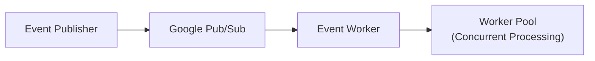
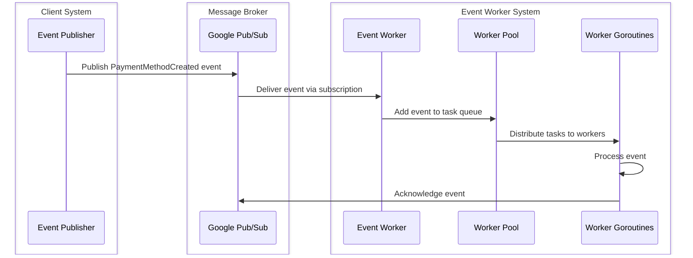

# Event Worker System

## Overview

This repository is a Proof of Concept (POC) project for exploring and evaluating implementation approaches for an Event Worker system. The code and architecture presented here are intended for learning and verification purposes only and are not meant to be used directly in production environments.

The Event Worker System demonstrates a scalable approach to processing events using a publisher-subscriber pattern with Google Cloud Pub/Sub. It showcases how to implement concurrent event processing with worker pools for efficient resource utilization.

### Key Features

- Event-driven architecture using Google Cloud Pub/Sub
- Concurrent event processing with configurable worker pools
- Scalable design for handling high volumes of events
- Local development environment with Pub/Sub emulator

## Disclaimer

**This is a Proof of Concept (POC). It is not recommended for use in production environments.**

This project is experimental and may not implement best practices, comprehensive error handling, or security measures. For actual application development, please use this code as a reference while making appropriate improvements suitable for production environments.

## Architecture

The system consists of two main components:

1. **Event Publisher**: Publishes events to a Pub/Sub topic
2. **Event Worker**: Subscribes to the topic and processes events using a worker pool



### Sequence Diagram

The following sequence diagram illustrates the event processing flow:



### Event Flow

1. The Event Publisher creates and publishes PaymentMethodCreated events to the "payment-method-created-topic" topic
2. The Event Worker subscribes to the topic via the "payment-method-created-subscription" subscription
3. When events are received, they are added to a worker pool task queue
4. Worker goroutines process the events concurrently from the task queue
5. Each event is logged and acknowledged after processing

## Project Structure

- `cmd/`: Application entry points
  - `event_publish/`: Event publisher application
  - `event_worker/`: Event worker application
  - `develope/`: Development utilities
- `internal/`: Internal packages
  - `core/`: Core utilities
    - `parallel/`: Concurrent processing utilities (worker pool implementation)
    - `env/`: Environment configuration utilities
  - `event/`: Event definitions and handlers
- `terraform/`: Infrastructure configuration

## Development

### Prerequisites

- Go 1.24 or later
- Docker and Docker Compose

### Setup

1. Start the PubSub emulator:

```bash
# Set the project ID for the PubSub emulator
export PUBSUB_PROJECT_ID=local-project

# Start the PubSub emulator using Docker Compose
docker compose up -d
```

2. Set up the PubSub topics and subscriptions:

```bash
# Run the setup-pubsub target from the Makefile
make setup-pubsub
```

**Note**: There appears to be a discrepancy between the topic/subscription names in the Makefile and the application code. The Makefile creates "payment-method-created" and "payment-method-created-sub", while the code uses "payment-method-created-topic" and "payment-method-created-subscription". You may need to adjust these to match.

### Build

To build the applications:

```bash
# Build the event worker
go build -o bin/event_worker cmd/event_worker/main.go

# Build the event publisher
go build -o bin/event_publish cmd/event_publish/main.go

# Build all applications
go build ./...
```

### Run

To run the applications:

```bash
# Run the event worker
go run cmd/event_worker/main.go

# Run the event publisher
go run cmd/event_publish/main.go
```

For a complete demonstration:

1. Start the PubSub emulator and set up topics/subscriptions as described in the Setup section
2. Run the event worker in one terminal
3. Run the event publisher in another terminal
4. The publisher will send 100 test events that will be processed by the worker

### Configuration

The system has several configurable parameters:

- **Worker Pool Size**: The number of concurrent workers (default: 1000)
- **Task Queue Buffer Size**: The buffer size for the task queue (default: 1000000)
- **PubSub Project ID**: The Google Cloud project ID (default: "local-project")
- **Topic and Subscription Names**: The names of the PubSub topics and subscriptions

These parameters can be modified in the application code.

### Test

To run the tests:

```bash
# Run all tests
go test ./...

# Run tests with verbose output
go test -v ./...

# Run tests for a specific package
go test -v ./internal/core/env
```

## Troubleshooting

### Common Issues

1. **PubSub Emulator Connection Issues**
   - Ensure the emulator is running: `docker compose ps`
   - Check emulator logs: `docker compose logs pubsub`
   - Verify the PUBSUB_PROJECT_ID environment variable is set correctly

2. **Topic/Subscription Mismatch**
   - Ensure the topic and subscription names in the Makefile match those in the application code
   - If they don't match, either update the Makefile or the application code

3. **Worker Not Processing Events**
   - Check that the worker is subscribed to the correct subscription
   - Verify that the publisher is publishing to the correct topic
   - Ensure the worker pool is properly initialized

## Contributing

Contributions to improve this POC are welcome. Please follow these steps:

1. Fork the repository
2. Create a feature branch
3. Make your changes
4. Submit a pull request

## License

This project is licensed under the MIT License - see the [LICENSE](LICENSE) file for details.
